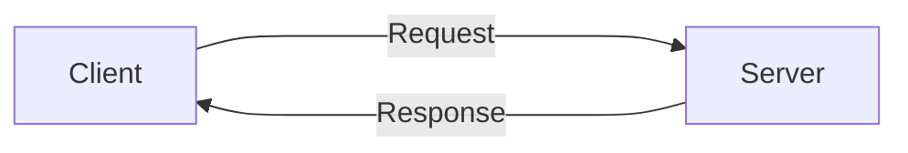

# Session과 Cookie

웹 개발을 할 때 빠질 수 없는 클라이언트와 서버 간의 통신을 위한 Sessioㄷn과 Cookie를 알아볼 것이다.

Session과 Cookie는 웹 통신간 저장해야할 정보를 가지고 있는 것이고

Http 프로토콜의 약점을 보안하기 위해 만들어졌다.

### Http가 무엇인가?

Session과 Cookie를 알기 전 Http에 대해 알아보겠다.

Http는 텍스트 기반의 통신 규약으로 클라이언트와 서버 간의 데이터를 교환할 수 있는 통신이다.

Request Response 구조로 되어있으며

우리가 JSON으로 데이터를 주고 받는 것을 예시로 들 수 있다.

### Session과 Cookie

그럼 Http 통신의 약점은 무엇인가?

첫번째 통신에서 데이터를 주고 받아도 두번째 통신에서는 어떤 데이터를 주고 받았는지 알 수 없다.

로그인을 하고 페이지에 들어왔는데 페이지 로딩을 할 때마다 다시 로그인을 해야하는 등을 예로 들 수 있다.

#### 그럼 먼저 Session에 대해 알아보겠다.

Session은 사용자가 웹 브라우저에 들어와서 종료할 때까지를 말한다.

웹 브라우저에 들어와 있는 시간을 Session이라고 하는 것이다.

세션은 서버에 저장이 되는 웹 서버 리소스이다. 웹 브라우저를 닫거나 서버에서 세션을 삭제했을 때만 삭제가 되므로 Cookie보다 보안이 좋다.

서버가 허용하는 한 용량 제한은 없다.

#### Cookie에 대해 알아보겠다.

Cookie는 사용자 컴퓨터에 저장하는 기록 파일이다. 클라이언트의 PC에 저장을 했다가 필요할 때 정보를 재사용할 수 있다.

클라이언트가 페이지를 요청할 경우 서버에서 Cookie를 넘겨준다.

Cookie를 클라이언트가 가지고 있다가 페이지 재방문시 Cookie가 존재할 경우 Cookie를 요청과 함께 전송한다.

이름, 값, 만료일, 경로 정보 등으로 구성되어 있으며 Session보다 빠르다.
