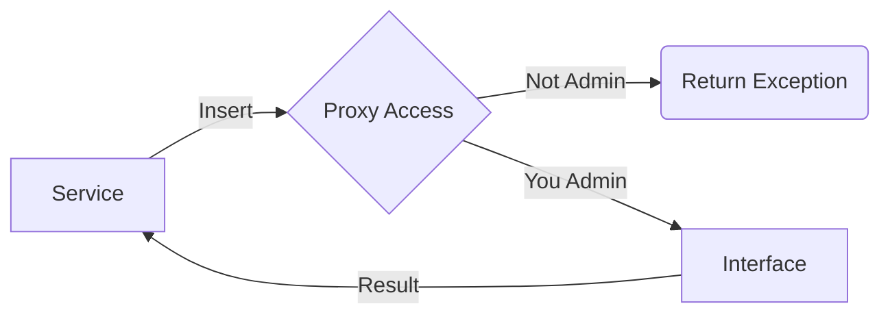
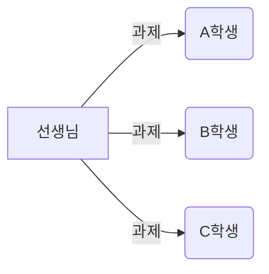
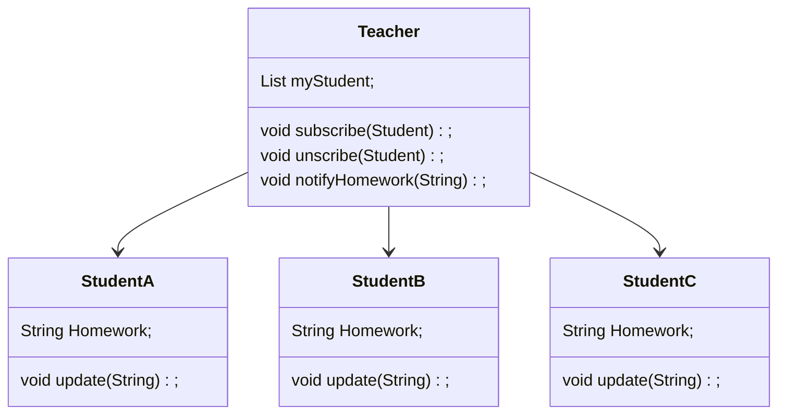
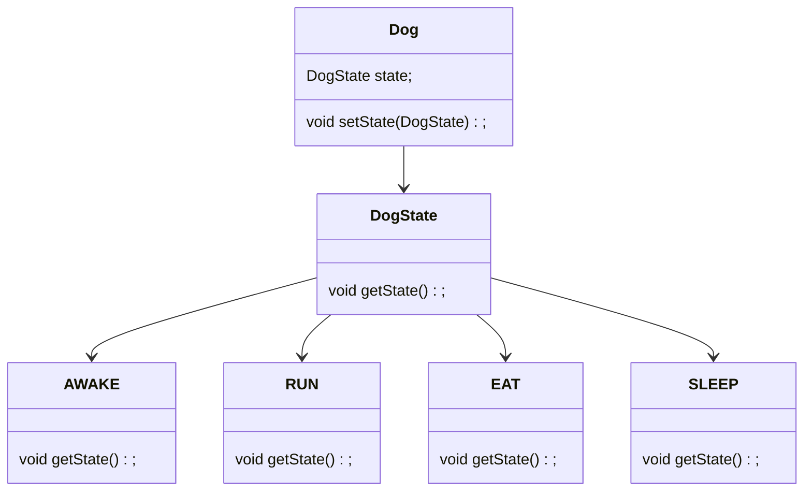

# 디자인 패턴

### 디자인 패턴은 효율적인 코드를 짜기 위해 사용하는 방법이다.

### 디자인 패턴의 종류는 크게 3가지로 나뉜다.

### 1. 생성 패턴 2. 구조 패턴 3. 행위 패턴

---

## 생성 패턴

생성패턴의 종류

#### 1. 싱글톤 패턴(Singleton Pattern) 
#### 2. 팩토리 메서드 패턴(Factory Method Pattern)
#### 3. 추상 팩토리 패턴(Abstract Factory Pattern)
#### 4. 빌더 패턴(Builder Pattern)
#### 5. 원형 패턴(Prototype Pattern)

### 싱글톤 패턴

최초 한번만 메모리를 할당해 인스턴스를 생성하고 하나의 인스턴스를 공유하면서 사용하는 방식이다.

책임이 많은 객체라면 유지보수 비용이 많이 들기 때문에 책임이 적은 객체에만 사용하는 것이 좋다.

장점
1. 한번의 메모리 할당으로 메모리 낭비를 줄인다.
2. 두번째 객체 호출시에는 객체 생성을 하지 않아도 된다.

단점
1. 동시성의 문제가 생길 수 있다.
2. 결합도가 높아져 개방폐쇄 원칙을 위배할 수 있다.

DBCP(DB Connection Pool, DB와 연결을 맺고 있는 객체)와 같은 공통된 객체를 여러개 생성해 사용할 때 주로 쓰이는 방식이다. 

### 팩토리 메서드 패턴

객체 생성 처리를 서브 클래스로 분리해 더욱 캡슐화시키고 결합도는 낮추는 방식이다.

객체를 생성하기 위한 인터페이스를 정의하고 인스턴스를 생성할지에 대한 처리는 서브 클래스가 결정하는 방식이다.

### 추상 팩토리 패턴

관련있는 객체들을 하나의 팩토리로 묶어 이를 조건에 따라 생성할 수 있도록 하는 방식이다.

팩토리 메서드 패턴과 비슷하지만 공통점과 차이점이 있다.

공통점은 객체를 캡슐화한다는 점이다.

차이점으로는 팩토리 메서드는 일반적으로 하나의 객체를 생성할 때 사용하지만

추상 팩토리 패턴은 여러 객체를 하나의 집합으로 만들 때 사용한다고 한다.

추상 팩토리 패턴은 팩토리 메서드 패턴보다 조금 더 캡슐화한 방식이라고 생각하면 편할 것 같다.

### 빌더 패턴

객체를 생성할 때 많은 변수나 파라미터, 상태값의 처리할 때 생기는 문제점을 해결해주는 방식이다.

Lombok의 @Builder 어노테이션을 생각하면 이해하기 쉽다.

```java
Member member = new Member(age, number, grade, ... );
```
위의 예제와 같이 객체를 생성할 때 필요한 파라미터가 많아진다면 타입, 순서 관리가 어려워진다.

```java
Member member = Member.builder()
          .age(age)
          .number(number)
          .grade(grade)
             ⁝
          .build();
```

그렇기 때문에 LomBok의 @Builder 같은 방식을 사용하는 것이 빌더 패턴이다.

### 원형 패턴

새로운 객체를 생성할 때 지속적으로 new 하는 것은 부담이 크기 때문에 원래의 객체의 복사본을 만들어 데이터의 수정을 해주는 방식이다.

원형 패턴은 비슷한 객체를 지속적으로 생성해야 할 때 유용하게 쓰인다.

객체 생성의 비용을 줄일 수 있고 객체의 각 부분을 조합해 생성할 수 있는 장점이 있다.

단점으로는 생성될 객체의 클래스들이 clone() 메서드를 구현해야한다.

## 구조 패턴

구조 패턴의 종류

#### 1. 적응자 패턴(Adapter Pattern)
#### 2. 브리지 패턴(Bridge Pattern)
#### 3. 컴포지트 패턴(Composite Pattern)
#### 4. 데코레이터 패턴(Decorator Pattern)
#### 5. 퍼사드 패턴(Facade Pattern)
#### 6. 프록시 패턴(Proxy Pattern)

### 적응자 패턴

한 클래스에서 사용하고자 하는 다른 인터페이스로 변환할 때 사용하며

인터페이스 호환성이 맞지 않아 같이 쓸 수 없는 클래스를 연관 관계로 연결해서 사용할 수 있게 하는 방식이다.

충전기의 타입이 맞지 않을 때 어댑터를 사용해 호환이 가능하도록 할 수 있듯이

호환이 안되는 인터페이스를 중간에서 연결시켜주는 역할을 한다.

### 브리지 패턴

구현부에서 추상층과 분리해 각자 독립적으로 변형과 확장이 가능하도록 설계합니다.

기능과 구현에 대해 두 개를 별도의 클래스로 구현하는 방식이다.

### 컴포지트 패턴

여러 개의 객체들로 구성된 복합 객체와 단일 객체를 클라이언트에서 구별없이 다루게 해주는 방식이다.

컴포지트 패턴은 Leaf, Composite, Component로 구성할 수 있는데 

Leaf는 구체적인 부분 클래스인 Component의 부품이다.

Composite는 여러개의 Component를 가지는 전체 클래스이다.

Component는 Leaf와 Composite를 이어주는 공통 인터페이스이다.

새로운 Leaf(부품)이 추가되도 Compenent 클래스를 이용하면 전체적인 코드 변경이 일어나지 않아도 된다.

### 데코레이터 패턴

주어진 상황에 따라서 어떤 객체에 책임을 덧붙이는 방식이다.

장점
1. 기존 코드를 수정하지 않고 확장을 할 수 있다.
2. 실행 중에 새로운 행동을 추가할 수 있다.

단점
1. 의미없는 객체들이 너무 많이 추가될 수 있다.
2. 코드가 필요 이상으로 복잡해질 수 있다.

서브 클래스를 사용하는 대신 조합하는 방식으로 객체를 장식한다고 생각하면 쉽게 이해할 수 있을 것이다.

### 퍼사드 패턴

인터페이스를 단순화 시키기 위해서 인터페이스를 변경하는 방식이다.

그렇기 때문에 복잡한 시스템을 훨씬 쓰기 쉬운 인터페이스로 구현할 수 있다.

클라이언트와 서브 시스템이 서로 긴밀하게 연결하지 않아도 되고, 최소 지식 원칙을 준수하는데 도움을 준다.

##### 어떤 메서드에서든 아래 종류의 메서드만 호출하면 여러 객체와 인연을 맺지 않아도 된다.
1. 객체 자체
2. 메서드에 매개변수로 전달된 객체
3. 그 메서드를 생성하거나 인스턴스를 만든 객체   
4. 그 객체에 속하는 구성요소

### 프록시 패턴

어떤 객체에서 다른 객체로 접근하는 것을 통제하기 대리인 객체를 제공하는 방식이다.

장점
1. 사이즈가 큰 객체가 로딩되기 전에도 프록시를 통해 참조를 할 수 있다.
2. 실제 객체의 public, protected 메소드를 숨기고 인터페이스를 통해 노출시킬 수 있다.
3. 로컬에 있지 않고 떨어져있는 객체를 사용할 수 있다.
4. 원래 객체에 접근에 대해 사전처리를 할 수 있다.

단점
1. 객체를 생성할 때 한 단계를 거치게 되므로, 빈번한 객체 생성이 필요한 경우 성능이 저하될 수 있다.
2. 프록시 내부에서 객체 생성을 위해 스레드가 생성, 동기화가 구현되어야 하는 경우 성능이 저하될 수 있다.
3. 로직이 난해해져 가독성이 떨어질 수 있다.

예시로 Proxy에서 간단한 처리를 해 보안의 역할을 지닐 수 있다.



## 행위 패턴

행위 패턴의 종류
#### 1. 옵저버 패턴(Observer Pattern)
#### 2. 상태 패턴(State Pattern)
#### 3. 스트레이트지 패턴(Strategy Pattern)
#### 4. 템플릿 패턴(Template Pattern)
#### 5. 비지터 패턴(Visitor Pattern)
#### 6. 역할 사슬 패턴(Chain of Responsibility Pattern)
#### 7. 커맨드 패턴(Command Pattern)
#### 8. 인터프리터 패턴(Interpreter Pattern)
#### 9. 미디에디터 패턴(Mediator Pattern)

### 옵저버 패턴

객체들 사이에 1:N의 의존관계를 정의하여 어떤 객체의 상태가 변할 때, 의존 관계에 있는 모든 객체들이 자동으로 갱신될 수 있게 만드는 방식이다.


위와 같은 예시가 있다.

주로 분산 이벤트 핸들링 시스템을 구현하는데 사용된다. 발행/구독 모델으로 알려져 있다.



### 상태 패턴

상태를 클래스로 생성하고 해당 상태에서 할 수 있는 행위를 메서드를 정의하는 방식이다.

```java
if(state.equals("AWAKE")) {
    System.out.println("일어난 상태입니다!");
}
else {
    System.out.println("자는 상태입니다!");
}
```
만약 AWAKE 상태와 SLEEP 상태를 가질 수 있다면 위와 같은 코드를 짜게 될 것이다.

하지만 AWAKE 상태와 SLEEP 상태말고도 가질 수 있는 상태가 여러개 있다면 아래와 같은 상황이 벌어질 것이다.

```java
if(state.equals("AWAKE")) {
    System.out.println("일어난 상태입니다!");
}
else if(state.equals("RUN")){
    System.out.println("뛰는 상태입니다!");
}
else if(state.equals("EAT")) {
    System.out.println("식사 상태입니다!");
}
else {
    System.out.println("자는 상태입니다!");
}
```
이와 같이 상태의 갯수와 비례해 분기절이 길어질 것이다.

개방폐쇄 원칙(OCP)를 위배하는 상황이 생기는 것이다.

그렇기 때문에 아래와 같이 상태를 클래스로 사용하게 된다면 쉽게 해결할 수 있을 것이다.



### 스트레이트지 패턴

// 임시 저장

