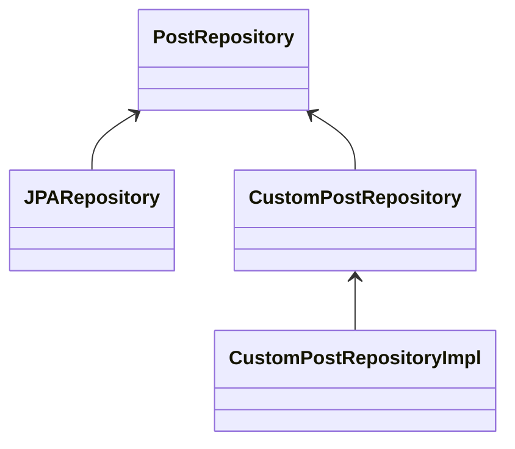
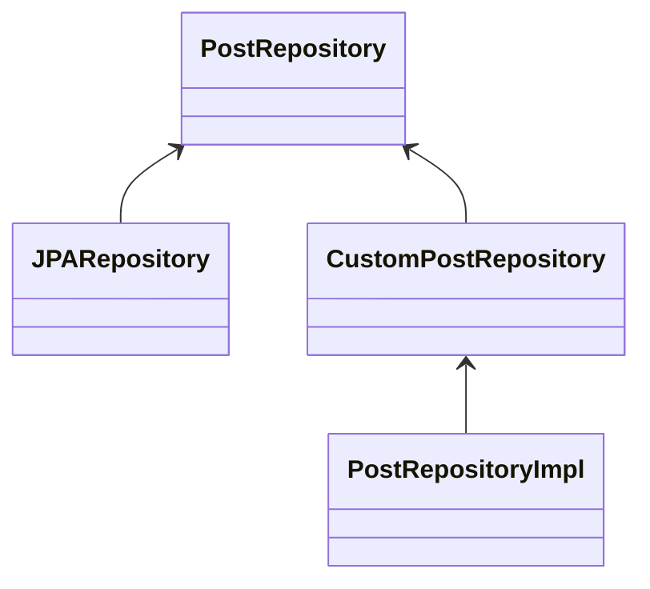

# Interface Impl Error

#### JPA + Querydsl interface를 만드는 중 "No property xxx found for type xxx !" 라는 에러와 실행이 거부되었다.

#### "Failed to create query for method public abstract (...repository)" 라는 문구로 같이 뜨는 걸 봐서

#### Querydsl interface의 구현이 적용되지 않았다고 추측하게 되었다.



#### 당시 내 interface 구조이다. (CustomRepository == QueryDsl)

#### CustomPostRepository의 Method를 CustomPostRepositoryImpl에서 구현을 해주었는데

#### 적용이 되지 않는 것에 의문이 들어 찾아보게 되었다.

#### 찾아본 결과 JPA와 함께 사용자 정의 레파지토리를 구현할 때 (Interface Name) + Impl로 지어야 Spring Data JPA가 사용자 정의 구현 클래스인지 인식하게 된다고 한다.

#### 위의 구현 클래스 이름과 다르게 아래처럼 써야 JPA가 인식할 수 있다는 것이다.


#### 만약 Impl가 아닌 다른 이름을 붙이고 싶다할 땐 Config에 아래와 같은 형식으로 작성해주면 된다.

```java
@EnableJpaRepositories(basePackages = "(레포지토리 폴더)", repositoryImplementationPostfix = "(원하는 이름)") // default = 'Impl'
```

#### JPA를 오래 사용해보았지만 커스텀해보지 않아서 클래스 이름도 영향을 주는지 몰랐다.
